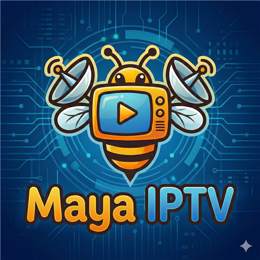
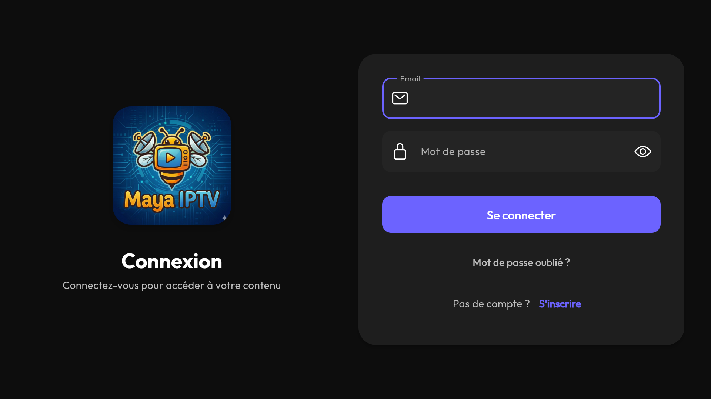
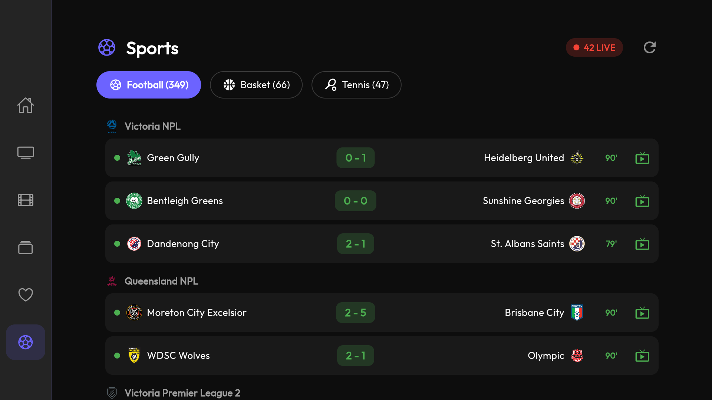
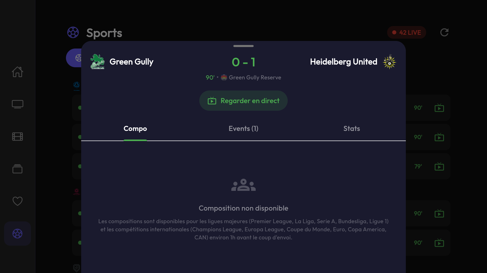

# Maya IPTV

**A modern, fast and free IPTV player for Android, Android TV / Fire TV, Windows and iOS.**

[Website](https://mayaiptv.com) · [Discord](https://mayaiptv.com/discord) · [Privacy policy](https://mayaiptv.com/privacy/)

> **Maya IPTV is a media player.** It does **not** provide, host or sell any channels, movies or subscriptions. You sign in with your **own subscription** (Xtream Codes or Stalker Portal) provided by your operator. You are responsible for the legality of the streams you play.

## Downloads

| Platform | File | Notes |
|---|---|---|
| 📱 Android (phones & tablets) | [`maya-mobile-arm64.apk`](https://github.com/yannsar/mayaiptv-downloads/releases/latest/download/maya-mobile-arm64.apk) | Most recent devices |
| 📺 Android TV / Fire TV Stick | [`maya-tv-armv7.apk`](https://github.com/yannsar/mayaiptv-downloads/releases/latest/download/maya-tv-armv7.apk) | Firestick, Shield, TV boxes — [install guide](https://mayaiptv.com/en/guide/install-iptv-fire-tv-stick/) |
| 🖥️ Windows x64 | [`MayaIPTV-Windows.zip`](https://github.com/yannsar/mayaiptv-downloads/releases/latest/download/MayaIPTV-Windows.zip) | Unzip and run `mayaiptv.exe` — [setup guide](https://mayaiptv.com/en/guide/free-iptv-player-windows/) |
| 🍎 iOS | [`MayaIPTV-iOS.ipa`](https://github.com/yannsar/mayaiptv-downloads/releases/latest/download/MayaIPTV-iOS.ipa) | Sideload via SideStore/AltStore — [iOS guide](https://mayaiptv.com/en/ios/) |

**iOS SideStore source:** add `https://raw.githubusercontent.com/yannsar/mayaiptv-downloads/main/sidestore.json` to SideStore to get updates automatically.

## Features

- **Live TV** with program guide (EPG) and fast zapping
- **Movies & series (VOD)** — rich detail pages, resume playback, seasons and episodes
- **Full TV interface** designed for the remote (D-pad) on Android TV and Fire TV
- **Offline downloads** — watch without a connection
- **Chromecast** support
- Favorites, Continue Watching, smart search
- Built-in **live football scores**
- Subtitles, multiple audio tracks, advanced player settings
- Multi-connection: manage several subscriptions
- Available in **8 languages** — English, French, German, Spanish, Italian, Portuguese, Ukrainian, Arabic
- **Free, ad-free**

## Screenshots

| | | |
|---|---|---|
|  |  |  |

## Getting started

1. Install the app for your platform (table above).
2. Create a free Maya account in the app.
3. Add your IPTV provider connection — Xtream Codes (server URL + username + password) or Stalker Portal (portal URL + MAC). New to this? Read the [Xtream Codes setup guide](https://mayaiptv.com/en/guide/xtream-codes-setup/).
4. Enjoy live TV, movies and series with your own subscription.

Looking for an alternative to your current player? See our honest [comparison with IPTV Smarters](https://mayaiptv.com/en/guide/iptv-smarters-alternative/).

## Support

- 💬 [Discord community](https://mayaiptv.com/discord) — help, news and feedback
- ✉️ contact@mayaiptv.com
- 🔒 [Privacy policy](https://mayaiptv.com/privacy/) · [Account deletion](https://mayaiptv.com/delete-account/)

---

Guides in other languages: <a href="https://mayaiptv.com/guide/installer-iptv-fire-tv-stick/">Français</a> · <a href="https://mayaiptv.com/de/guide/iptv-auf-fire-tv-stick-installieren/">Deutsch</a> · <a href="https://mayaiptv.com/es/guide/instalar-iptv-fire-tv-stick/">Español</a> · <a href="https://mayaiptv.com/it/guide/installare-iptv-fire-tv-stick/">Italiano</a> · <a href="https://mayaiptv.com/pt/guide/instalar-iptv-fire-tv-stick/">Português</a>

